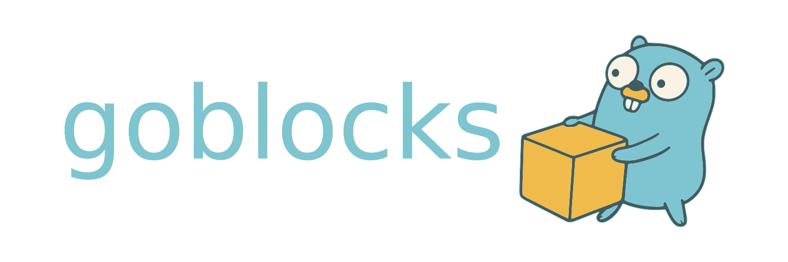

<h1 align="center">
  
</h1>

Goblocks is a fast, flexible Go implementation of a recursive algorithm for computing conformal blocks (described in [1307.6856](https://arxiv.org/abs/1307.6856)), supporting both CLI and library modes, with choice between efficient binary or CSV outputs.

## 🚀 Features

- **Two modes of operation**:
  - CLI: Pass all parameters via command-line arguments
  - Library: Pass all parameters in JSON format to highly efficient C library.

- **Binary output**: Compact machine-readable binary output which is much faster than plaintext or JSON.
- Written in **pure Go** with no compulsory dependence on external dependencies (except when compiling with CUDA)
- Easily callable from Python or shell scripts
- Native concurrency using goroutines
- Example Python code provided

---

## 🔧 Installation

### CLI and libraries (optional GPU acceleration)
Assuming all of the pre-requisite Go compiler is installed: from within the `server/src` directory, simply run
```bash
make
```
or for GPU accelerated evaluation of blocks:
```bash
make GPU=1
```

If the user does not have Go installed, it can be easily downloaded from the _excellent_ site: [https://go.dev/doc/install](https://go.dev/doc/install).

### Python client
The Python Goblocks client may be installed _from the `client` directory_ simply by typing

```
pip install .
```

To verify the installation, simply load a Python interactive interpreter and attempt to import and run modules from `goblocks_client`:

```python
from goblocks_client import BlockHandle

# Create a handle
handle = BlockHandle()
print(handle.run_request()

# Free the C handle when done
handle.free_handle()
```

---

## Command line interface (CLI)
The server allows single shot evaluations of both the points-based and crossing symmetric point derivative evaluations to be performed from the command line.

## Example usage (CLI)

**From the CLI (singleshot)**
```bash

Usage of ./bin/goblocks:
  -blocks string
        comma-separated list of block types '+' or '-' (cli mode) (default "+")
  -cache_dir string
        Cache directory (cli mode) (default "cache")
  -command string
        command to run (cli mode) (default "recurse_and_evaluate_df")
  -d int
        dimension (cli mode) (default 3)
  -delta12 float
        delta12 (cli mode)
  -delta34 float
        delta34 (cli mode)
  -deltaave23 float
        delta average 23 (cli mode) (default 0.25)
  -deltas string
        comma-separated list of delta values (cli mode) (default "1.0")
  -ellmax int
        ellmax (cli mode) (default 20)
  -ellmin int
        ellmin (cli mode)
  -ells string
        comma-separated list of ell values (cli mode) (default "0")
  -eta float
        eta (radial coords -- cli mode) (default 1)
  -k1max int
        k1max (cli mode) (default 20)
  -k2max int
        k2max (cli mode) (default 20)
  -maxiter int
        max iterations (cli mode) (default 100)
  -nmax int
        Maximum derivative order (cli mode) (default 7)
  -normalise
        Normalise the derivative block (cli mode) (default true)
  -output string
        output format: 'binary' or 'csv' (default "csv")
  -r float
        r (radial coords -- cli mode) (default 0.1715728752538097)
  -tol float
        tolerance (cli mode) (default 0.0001)
  -use_numeric_derivs
        Use the numeric derivatives where available (cli mode)
  -use_precomputed_phi_1
        Use the precomputed phi 1 (cli mode) (default true)
  -zs string
        comma-separated list of z values (cli mode) (default "0.5+0i")

```

## Python client (library wrapper)
The GoBlocks client provides a convenient way to access conformal blocks with the `BlockHandle` class; `BlockHandle` is a Python wrapper around a single C handle. We also include `BlockHandlePool`, which manages multiple handles safely, reusing idle handles and creating new ones as needed. This is convenient, for example when performing multi-threaded optimisation with PyGMO.

**Key Features:**

- Thread-safe handle pool
- Automatic reuse of idle handles
- Optionally create new handles when all are busy
- Context manager interface for clean acquisition/release
- Automatic warning if request parameters conflict with handle defaults

---

### Example usage (client)

For more information of BlockHandle and BlockHandlePool arguments, please consult the wiki.

```python
from goblocks_client import BlockHandle

# Create a handle
handle = BlockHandle(
        k1_max=10,
        k2_max=10,
        ell_min=0,
        ell_max=6,
        d=3,
        nmax=8,
        cache_dir="cache",
        use_precomputed_phi1=True,
)

# Run a computation request
result = handle.run_request(
        command="recurse_and_evaluate_df",
        deltas=[5.1],
        ells=[3],
        block_types=["+", "-"],
        delta_12=1.6,
        delta_34=1.2,
        delta_ave_23=3.1,
        max_iterations=100,
        tol=1e-4,
        r=0.1715728753,
        eta=1.0,
        nmax=8,
        normalise=True,
        use_numerical_derivs=False,
)

print("Result:", result)

# Free the C handle when done
handle.free_handle()
```


One may also use the pool:

```python
from goblocks_client import BlockHandlePool

# Create a pool (optional: pass default handle parameters)
pool = BlockHandlePool(
        k1_max=10,
        k2_max=10,
        ell_min=0,
        ell_max=6,
        d=3,
        nmax=8,
        cache_dir="cache",
        use_precomputed_phi1=True,
)

# Using the context manager (recommended)
with pool.get() as handle:
    result = handle.run_request(
        command="recurse_and_evaluate_df",
        deltas=[5.1],
        ells=[3],
        block_types=["+", "-"],
        delta_12=1.6,
        delta_34=1.2,
        delta_ave_23=3.1,
        max_iterations=100,
        tol=1e-4,
        r=0.1715728753,
        eta=1.0,
        nmax=8,
        normalise=True,
        use_numerical_derivs=False,
)
    print("Result:", result)

# Free all C handles when finished
pool.close_all()
```
## Citation
If you use this repository, please cite! If you use with BootSTOP-multi-objective, please cite that too.

```bibtex
@article{Chryssanthacopoulos:2026GoBlocks,
  author  = {Chryssanthacopoulos, James and
             Niarchos, Vasilis and
             Papageorgakis, Constantinos and
             Stapleton, Alexander G.},
  title   = {Efficient Conformal Block Evaluation with GoBlocks},
  year    = {2026},
  eprint  = {2603.10627},
  archivePrefix = {arXiv},
  primaryClass  = {hep-th},
  doi     = {10.48550/arXiv.2603.10627},
  url     = {https://arxiv.org/abs/2603.10627}
}

@software{goblocks,
  author  = {Chryssanthacopoulos, James and
             Niarchos, Vasilis and
             Papageorgakis, Constantinos and
             Stapleton, Alexander G.},
  title   = {{GoBlocks}},
  year    = {2026},
  url     = {https://github.com/xand-stapleton/goblocks}
}
```


